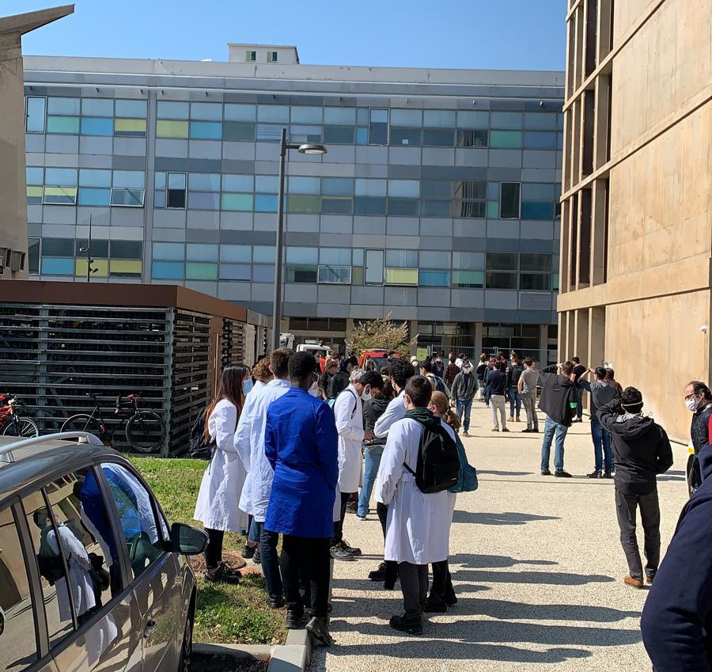

## Comment naviguer dans cette présentation ?

- D'une section à l'autre : →
- Dans une section ↓ (ou `N`)
- Echap pour accéder au sommaire 

# Pourquoi faire des sauvegardes ? {data-background=#984447}

## Le feu

{ width=50% }

## Le feu (2)

{ width=60% }

## Le vol

{ width=40% }

## L'effacement accidentel

{ width=40% }

## Le "ransomware"

{ width=60% }

## Le chien

{ width=40% }

## Data Management Plan

  + livrable de projets ANR et européens
  + un exercice qui peut s'avérer utile

  Quelques ressources: [1](https://bibliotheques.univ-tlse2.fr/accueil-bibliotheques/a-votre-service/donnees-de-la-recherche/accompagnement-au-pgd), [2](https://hal.inrae.fr/view/index/identifiant/hal-02791507), [3](https://anr.fr/fileadmin/documents/2019/ANR-modele-PGD.pdf), [4](https://urfist.univ-cotedazur.fr/portfolio_page/enjeux-des-donnees-de-la-recherche/)

  Inclut le partage/archivage de données de recherche (e.g. [Zenodo](https://zenodo.org/)) non traités ici

## Les grands principes
  
  + souvent
  + tout (toutes les versions de tous mes fichiers, sauf exceptions)
  + facile
  + efficace
  + robuste
  + vérifiable (cohérente et à jour)
  + paramétrable
  + redondant (plusieurs supports et emplacements)
  + accessible
  + documentée et structurée

## Comment faire ? {data-background=#984447}

# Que stocker ?   {data-background=#984447}

## les objets à stocker

Généralement: 

  + données brutes
  + données traitées / visualisations
  + le code, les logiciels
  + les productions scientifiques (article, thèse, présentations)
  + les outils de travail (todo, fiches,...)

→ problématiques différentes

## Les questions à se poser
  
+ volume de données
+ importance *(article vs todolist)*
+ type de fichiers *(texte/binaire/compressé?)*
+ fréquence d'accès
+ fréquence de modification
+ nombre de contributeurs (→ git?)
+ durée de stockage souhaitée
+ Single Point of Failure (SPF)

# Où stocker ? {data-background=#984447}

  
## sa mémoire 

  - on compte beaucoup dessus !
  - capacité limitée → [mots de passe réutilisés](https://haveibeenpwned.com/)
  - oublis
  - gestionnaires de mots de passe les plus utilisés
    + Bitwarden.com (en ligne, gratuit, open source)
    + 1password.com (en ligne, 3$/mois)
    + Keepass (local, logiciel libre)
    + Chrome ou firefox (intégré)

## Disque dur(s) externe(s)

  - "my precious"
  - support fragile 
  - soumis à l'usure (comme nous tous)
  - *toujours* éviter de compter sur un seul DD
  - vitesse de transfert relativement limitée
  - comment stocker efficacement dessus ?
  - pas infaillible

## NAS

  ou "support de stockage en réseau"

  - répond aux problèmes de fiabilité et de vitesse d'accès des DD grâce à plusieurs disques
  - coût / mise en place / entretien → souvent mutualisé
  - **pas infaillible** → un seul lieu, un seul appareil
  - pas forcément de **backup** (s'en assurer si possible)
  - pas forcément d'**historique** (contre la suppression accidentelle)
  - panne `home_INSA` en 2017

  **Avoir un plan s'il est inaccessible !** 

## cloud
  
  - différentes offres et outils
  - du plus basique au plus automatisé
  - prix à l'usage, très variables
  - Cloud act (USA) → OVH, Scaleway
  - **pas infaillible** (mais tâche de s'en rapprocher)

## Les questions à se poser

  + adéquation support/usage/données 
  + recommandations institutionnelles
  + fonctionnalités
  + limites d'accès (par politique, prix ou techniques)
  + contraintes

# Comment stocker ? {data-background=#984447}

## Petit lexique

## "Chiffré"

  - illisible sans une clé secrète
  - quasiment pas de ralentissement
  - essentiel pour le stockage non-local (surtout sous Cloud Act)
  - autrement, accès physique = accès à toutes les données
  - **perte de la clé = perte des données !**

## Compression

  - algorithme permettant d'utiliser moins de bits pour stocker la même chose
  - destructif (pour images, son, vidéo) ou non (le reste)
  - gain de place important (variable de x2 à x1000)
  - très efficace sur données brutes au format texte
  - aucun gain sur `.jpg, .mp3, .ppt, .xls, .doc, .mp4,...` qui sont déjà compressés
  - ralentissement conséquent
  - compromis vitesse/taille possible

## Déduplication

- Evite de réécrire plusieurs fois la même chose (gain de place et temps)
- Si j'ai le même fichier à deux emplacements, il n'est sauvegardé qu'une fois
- fonctionne par découpage en blocs et comparaison des blocs 

## Incrémental

- Seul l'écart entre deux versions est sauvegardé (nouveaux blocs)
- Les changements s'ajoutent comme les maillons d'une chaine
- Gain de temps et de volume à transférer/écrire
- Risque de compromission en amont → faire une vérification régulière

## Autres propriétés

- multi-plateforme → fonctionne sur plusieurs OS
- multi-supports → gère différents supports (ou backends)

## outils de sauvegarde {data-background=#984447}

##  versionnement

  - git
  - github / gitlab (bitbucket)
  - Instances Gitlab institutionnelles

  Voir formation Git

## Quelques solutions

## Tous OS :

Avec interface graphique (GUI) :

  - Duplicati (gratuit, multi supports)
  - Backblaze (60$/an, capacité illimitée)

En ligne de commande (CLI):

  - restic

Les outils CLI sont automatisables avec systemd ou cron sur Linux/Mac.

## Windows

Peu de solutions gratuites à part: 

- Cobian Backup (GUI, gratuit)

Solutions répertoriées sur [AlternativeTo](https://alternativeto.net/)

## Linux

- DejaDup (GUI)
- Duplicity (CLI)
- Bup (CLI)
- Borg (CLI)

## Mac OS

- Time machine (GUI)

## Conclusion

- Pas de sauvegarde parfaite, très difficile de tout concilier
- Souvent un coût non nul
- Les clés/mots de passe souvent le point le plus critique
- Éviter le SPF, toujours avoir deux supports distincts
- Toujours vérifier (à la main) que les données restent restaurables
- Ne pas faire confiance à un seul logiciel ou une source (ou cette formation !)

<!-- 
## Checklist -->

